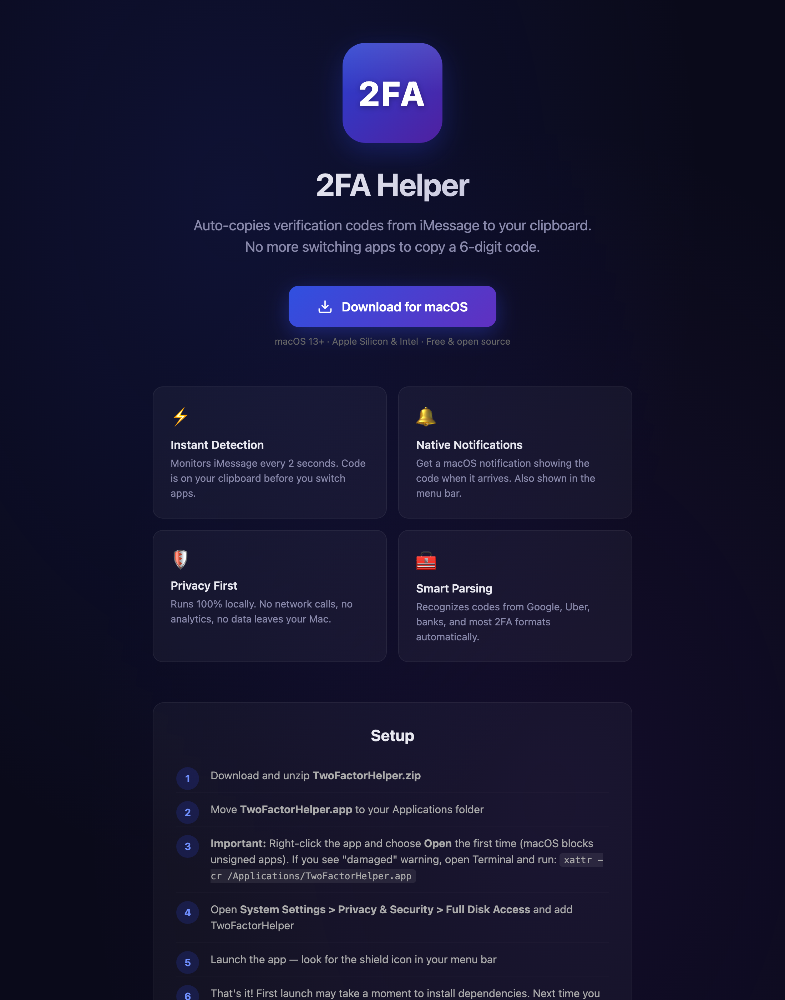
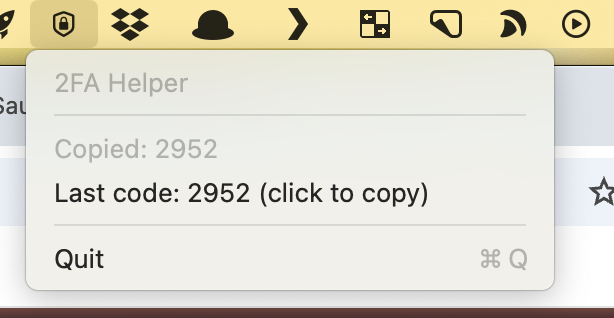

# TwoFactorHelper

A tiny macOS menu bar app that watches iMessage for two-factor authentication codes and **auto-copies them to your clipboard** the moment they arrive. No more switching to Messages, squinting at a 6-digit code, and typing it back by hand.

**[⬇️ Download for macOS](https://github.com/noahdevkagan/TwoFactorHelper/releases/latest/download/TwoFactorHelper.zip)** &nbsp;·&nbsp; **[🌐 Website](https://noahdevkagan.github.io/TwoFactorHelper/)**

macOS 13+ · Apple Silicon & Intel · Free & open source

<p align="center">
  <a href="https://noahdevkagan.github.io/TwoFactorHelper/">
    
  </a>
</p>

---

## How it works

TwoFactorHelper runs quietly in your menu bar (look for the 🛡️ shield icon). Every 2 seconds it checks your local Messages database for new incoming texts, recognizes 2FA/verification codes using a set of matching rules, and:

<p align="center">
  
</p>


- 📋 **Copies the code to your clipboard** automatically
- 🔔 **Shows a native macOS notification** with the code
- 🔢 **Displays the code in the menu bar** next to the icon (clears after 30s)
- 🕘 Keeps the **last code** in the menu so you can re-copy with a click

It recognizes the common formats — `123456 is your code`, `Your code is G-123456`, `PIN: 8842`, and most numeric/alphanumeric codes from Google, Uber, banks, and similar services.

## Privacy

Everything runs **100% locally on your Mac**. TwoFactorHelper reads your Messages database directly (`~/Library/Messages/chat.db`) — it makes **no network calls**, has no analytics, and no data ever leaves your machine.

## Install

1. **Download** and unzip [`TwoFactorHelper.zip`](https://github.com/noahdevkagan/TwoFactorHelper/releases/latest/download/TwoFactorHelper.zip)
2. Move **`TwoFactorHelper.app`** to your `/Applications` folder
3. The app is unsigned, so the first launch: **right-click → Open**. If macOS says the app is "damaged," clear the quarantine flag:
   ```bash
   xattr -cr /Applications/TwoFactorHelper.app
   ```
4. Grant **Full Disk Access** (required to read Messages): open **System Settings → Privacy & Security → Full Disk Access** and enable TwoFactorHelper
5. Launch it — you'll see the 🛡️ shield in your menu bar. The next 2FA text you get lands on your clipboard automatically.

## Run from source

Requires Python 3 and [PyObjC](https://pyobjc.readthedocs.io/).

```bash
git clone https://github.com/noahdevkagan/TwoFactorHelper.git
cd TwoFactorHelper
pip3 install pyobjc
python3 twofactor.py
```

You'll still need to grant **Full Disk Access** to your terminal (or the Python binary) so it can read the Messages database.

### Building the `.app`

The release bundle is built with [PyInstaller](https://pyinstaller.org/) using the included spec:

```bash
pip3 install pyinstaller pyobjc
pyinstaller twofactorhelper.spec
```

## FAQ

**Does it read all my messages?**
It reads the Messages database to find codes in incoming texts, but only code-like text is ever surfaced or copied. Nothing is sent anywhere — it all stays on your Mac.

**Why does it need Full Disk Access?**
macOS protects the Messages database. Full Disk Access is the only way for an app to read `chat.db`. If access isn't granted, the app tells you and retries automatically once you enable it.

**It's not detecting a code.**
Codes come in every 2 seconds of polling. If a particular service uses an unusual format, open an [issue](https://github.com/noahdevkagan/TwoFactorHelper/issues) with a redacted example and it can be added to the matcher.

## License

Free and open source. Built with Python & PyObjC.
